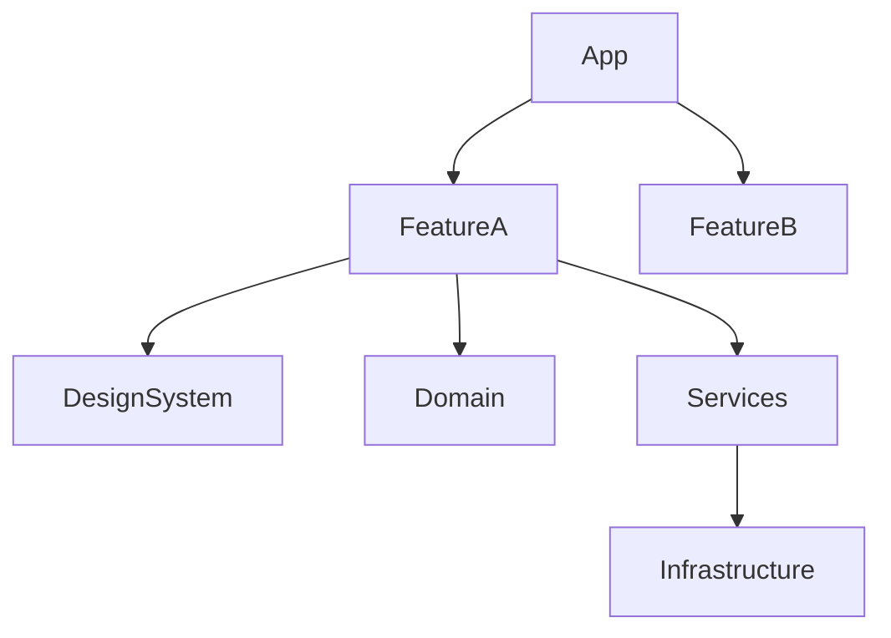

# Swift Architecture Analysis Methods

Analyze SwiftUI app architecture, target boundaries, module dependencies, modern Swift posture, and concurrency isolation.

## Analysis Flow

```
Project shape -> Layer identification -> Target/module dependencies -> Coupling -> Target architecture
```

## 1. Project Shape

```bash
swift --version
xcodebuild -version
rg --files -g 'Package.swift' -g '*.xcodeproj' -g '*.xcworkspace'
rg --files -g '*.swift' | sed -n '1,120p'
find . -maxdepth 3 -type d \( -name Sources -o -name Tests -o -name '*Tests' -o -name '*UITests' \)
rg 'swift-tools-version|name:|targets:|dependencies:|swiftSettings|defaultIsolation|enableUpcomingFeature|StrictConcurrency' Package.swift
```

Record:

- Swift and Xcode versions.
- Swift language mode, strict concurrency, default actor isolation, and upcoming feature flags.
- Xcode projects and workspaces.
- SwiftPM packages and targets.
- App, framework, test, and UI test targets.
- Minimum deployment target if discoverable.
- Scheme names if available.

## 2. Standard Layering

Default SwiftUI-first layers:

```
App
Features
DesignSystem
Domain
Services
Infrastructure
```

Expected dependency direction:

- App may assemble everything.
- Features may depend on DesignSystem, Domain, and Services.
- DesignSystem must not depend on app-specific Features.
- Domain must remain UI-free.
- Services may depend on Domain and Infrastructure protocols.
- Infrastructure implements external boundaries and should not import SwiftUI unless it is a platform adapter.
- App and UI executable targets may choose MainActor default isolation; library layers should justify any broad MainActor isolation.

Discovery commands:

```bash
rg '^import ' --glob '*.swift'
rg 'import SwiftUI' --glob '*.swift'
rg 'enum .*Route|NavigationStack|navigationDestination' --glob '*.swift'
rg 'protocol .*Service|actor .*|struct .*Client|final class .*Client' --glob '*.swift'
rg 'SwiftData|@Model|@Query|ModelContainer|ModelContext' --glob '*.swift'
rg 'AppIntent|AppEntity|IndexedEntity|Transferable|SnippetIntent|ControlConfigurationIntent' --glob '*.swift'
```

## 3. Boundary Checks

Check for common violations:

```bash
rg 'import SwiftUI' Domain Services Infrastructure --glob '*.swift'
rg 'import UIKit' Domain Services Infrastructure --glob '*.swift'
rg 'import .*Feature|import Features' DesignSystem Domain Infrastructure --glob '*.swift'
rg '#if os\(|#if canImport|#if targetEnvironment' --glob '*.swift'
rg '@MainActor|nonisolated|@concurrent|@preconcurrency|@unchecked Sendable|nonisolated\(unsafe\)' --glob '*.swift'
```

Assess whether conditional compilation belongs in a platform adapter instead of scattered feature code.

## 4. Target Dependency Analysis

For SwiftPM:

```bash
rg 'target\(|executableTarget\(|testTarget\(' Package.swift
rg '\.target\(name:' Package.swift
```

For Xcode projects, inspect project settings with `xcodebuild -list` when appropriate, then record schemes and targets.

Build a dependency diagram:



## 5. Coupling and Isolation

Flag:

- Feature-to-feature imports.
- DesignSystem imports from Features or App.
- Domain importing UI frameworks.
- Services mutating UI state directly.
- `@MainActor` applied too broadly to non-UI services.
- Default actor isolation applied to library targets without an explicit reason.
- `@preconcurrency`, `@unchecked Sendable`, or `nonisolated(unsafe)` without a documented migration path.
- Missing actors for mutable shared resources.
- Missing protocols for services that need test doubles.
- SwiftData `ModelContext` escaping into Views or services without clear ownership.
- App Intents exposing app state without explicit entity/query boundaries.

## 6. Output Template

```markdown
# Architecture Analysis Report

## Project Shape
| Container | Targets/Schemes | Notes |
|-----------|-----------------|-------|

## Modern Swift Posture
| Area | Current | Recommendation |
|------|---------|----------------|
| Swift toolchain | | |
| Strict concurrency | | |
| Default actor isolation | | |
| Swift Testing | | |
| SwiftData | | |
| App Intents/System Experiences | | |

## Layers
| Layer | Paths/Targets | Responsibility |
|-------|---------------|----------------|

## Dependency Issues
| Location | Issue | Severity | Fix |
|----------|-------|----------|-----|

## Concurrency Boundaries
| Component | Isolation | Risk | Recommendation |
|-----------|-----------|------|----------------|

## Refactoring Tasks
1. [A-001] ...
```
