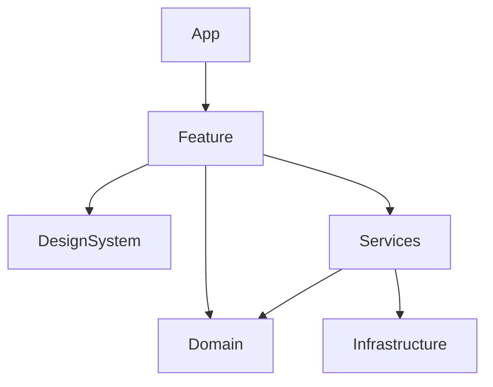
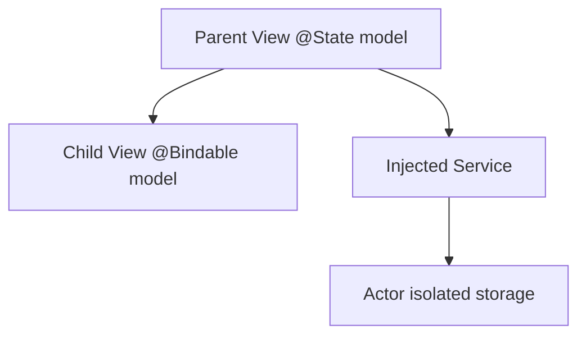
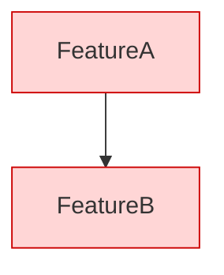

# Swift Diagram Conventions

Use Mermaid diagrams to make SwiftUI architecture and data flow easy to resume across sessions.

## Architecture Diagram



## Feature Call Flow

```mermaid
sequenceDiagram
    actor User
    participant View as SwiftUI View
    participant Model as @Observable Model
    participant Service as Service Protocol
    participant Actor as Actor/Infrastructure

    User->>View: Tap
    View->>Model: action()
    Model->>Service: await request()
    Service->>Actor: await boundary call
    Actor-->>Service: result
    Service-->>Model: value
    Model-->>View: observed state update
```

## State Ownership Diagram



## Dependency Direction

Draw arrows from consumer to provider. Mark violations in red in reports when useful.


